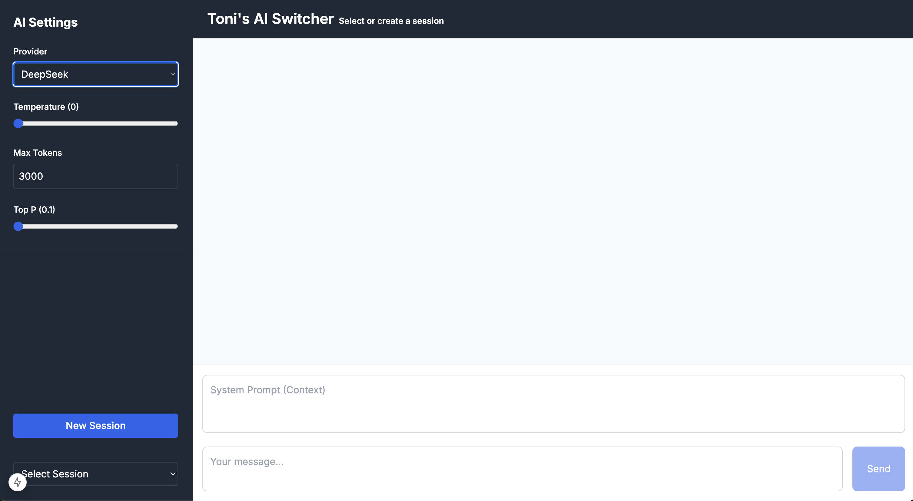

# Generative AI Switcher (Kotlin)

A Kotlin-based web application built with **Spring Boot** that allows you to switch between multiple Generative AI APIs
(e.g., DeepSeek, ChatGPT, Claude) and customize AI settings. 🤖

The app features a clean and structured frontend with a side menu for AI parameters and a main content area for chat 
interactions.

---

## Features

- **Multi-Chat Sessions**: Create, switch, and delete chat sessions.
- **Customizable AI Settings**: Adjust parameters like `temperature`, `max_tokens`, and `top_p`.
- **Multiple APIs**: Choose between different Generative AI APIs (DeepSeek, ChatGPT, Claude).
- **Chat History**: Stores chat sessions locally for retrieval and visualization.
- **Clean JSON Serialization**: Uses Kotlin data classes and Jackson for seamless API communication.

---

## Technologies Used

- **Backend**: Spring Boot (Kotlin, v.2.0.10, java 21)
- **Frontend**: HTML, CSS (Bootstrap), JavaScript (to be perhaps replaced by React later on, but I am not a frontend dev)
- **API Integration**: DeepSeek, ChatGPT, Claude
- **Build Tool**: Gradle (v. 8.12)

---

## Run it

**Pre-requisites**: 
You will need these (or at least 1) environment variables set:

```sh
   export DEEPSEEK_API_KEY=your_deepseek_api_key
   export CHATGPT_API_KEY=your_chatgpt_api_key
   export CLAUDE_API_KEY=your_claude_api_key
```

   ```bash
   
   # Just use the bash script to start both frontend and backend 
   ./start.sh
   ```

## Installation

If you want more control over the installation, you can follow these steps:

1. Clone the repository:
   ```bash
   git clone https://github.com/your-username/generative-ai-switcher-kotlin.git
   cd generative-ai-switcher-kotlin
   ```


### Backend


1. Run the application:
   ```bash
   ./gradlew bootRun
   ```

### Frontend

1. Open a new terminal and navigate to the `frontend` directory:
   ```bash
   cd frontend
   ```
   
2. Install the dependencies:
   ```bash
   pnpm install
   ```
   
3. Start the frontend:
   ```bash
    pnpm run build start
    ```
   
---

## API Endpoints

| Endpoint                          | Method | Description                                   |
|-----------------------------------|--------|-----------------------------------------------|
| `/api/create-session`             | POST   | Creates a new chat session.                   |
| `/api/get-session/{sessionId}`    | GET    | Retrieves a chat session by ID.               |
| `/api/delete-session/{sessionId}` | POST   | Deletes a chat session by ID.                 |
| `/api/generate`                   | POST   | Sends a prompt to the AI and gets a response. |

---

## Example Payloads

### **Generate Request**
```json
{
    "sessionId": "2024-12-28T18:43:33.174034",
    "apiName": "DeepSeek",
    "systemPrompt": "You are a helpful assistant.",
    "userPrompt": "Hello!",
    "temperature": 0.0,
    "maxTokens": 3000,
    "topP": 1.0
}
```

### **Generate Response**
```json
{
    "choices": [
        {
            "index": 0,
            "message": {
                "role": "assistant",
                "content": "Hello! How can I assist you today?"
            },
            "logprobs": null,
            "finish_reason": "stop"
        }
    ]
}
```

---

## Frontend Screenshots

 
*Side menu with AI settings and main chat area.*


---

## API Docs:

- [DeepSeek API](https://api-docs.deepseek.com/api/deepseek-api)
- [Claude / Anthropic](https://docs.anthropic.com/en/api/getting-started)
- [ChatGPT API](https://platform.openai.com/docs/overview)
- [Perplexity API](https://docs.perplexity.ai/home)

## Acknowledgments

- **DeepSeek, OpenAI, Anthropic, Perplexity**: For their Generative AI APIs.

---

Enjoy experimenting with different Generative AI models! 🚀
